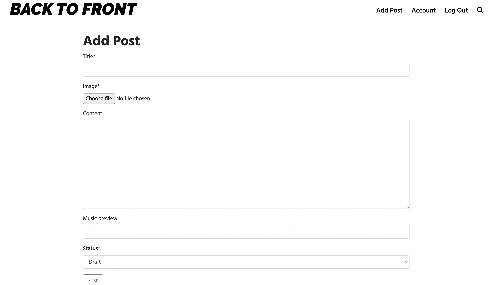
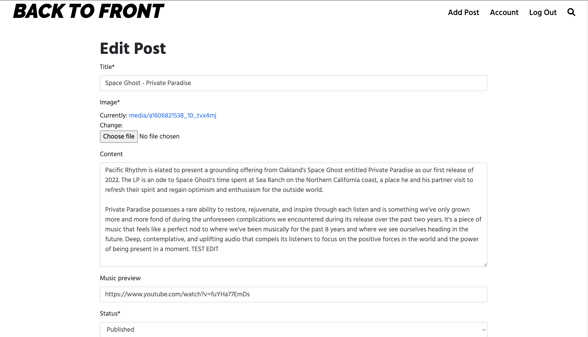

# Back To Front Blog

## Overview

Back To Front is a music blog aimed at fans of all genres/subgenres of electronic music. Admins can post reviews on new music releases, as well as DJ mixes to the site. Admins can add, edit & delete posts from the front end of the site allowing full CRUD functionality from the front end.

For normal users, they can preview the music being reviewed on each post through embedded links to Soundcloud/Youtube as well as read the review. Users can comment on each post to share their thoughts and interact with one another. Users can also save releases to their user account so if they like the release they can easily find it via the saved releases section.

Live link: https://backtofrontblog.herokuapp.com/

## Table Of Contents

- [User Stories](#user-stories)
  * [Admin](#admin)
  * [User](#user)
- [Design](#design)
  * [Colour Scheme](#colour-scheme)
  * [Fonts](#fonts)
  * [Imagery](#imagery)
- [Wireframes](#wireframes)
- [Features](#features)
  * [Navigation Bar](#navigation-bar)
  * [Footer](#footer)
  * [Featured-Post](#featured-post)
  * [Blog](#blog)
  * [Blog Posts](#blog-posts)
  * [User Profile](#user-profile)
  * [Mixes](#mixes)
- [Future Development](#future-development)
- [Database Schema](#database-schema)
- [Testing](#testing)
- [Deployment](#deployment)
  * [Local SetUp](#local-set-up)
  * [Heroku Deployment](#heroku-deployment)
- [Credits](#credits)
  * [Code](#code)
  * [Content & Images](#content-&-images)
  * [Music Previews & Mixes](#music-previews-&-mixes)

## User Stories

### Admin:

1. I want to be able to create an admin account and access its features
2. I want to be able to share posts based on music releases
3. I want to be able to leave posts as drafts so I can post when ready
4. I want to be able to share previews from the music releases on posts
5. I want to be able to add, edit & delete posts from the front end of the site
6. I want to be able to share DJ mixes to the site
7. I want to be able to be able to delete user comments if deemed necessary

### User:

1. I want to be able to read about new music releases
2. I want to be able to listen to music whilst on the site
3. I want to be able to sign up to the site to access features requiring an account
4. I want to be able to be able to comment on reviews/posts and share my thoughts/interact with other users
5. I want to be able to keep a record of music from the site which I like
6. I want to be able to intuitively navigate the site
7. I want to be able to search the site

To implement these with an agile method I used GitHub projects, and you can see this in the project section of the repository.

## Design

### Colour Scheme

The main colour scheme for the website is based on white & black to keep things clean and simple. A very light blue/gray colour was then used to accentuate other features/elements such as hovering over links, or the background colour for blog post images.

There are also the colours used for the 'Mixes' images, however these are not intended to be part of the colour scheme rather they are unique to each mix posted on the site both already and for future posts.

### Fonts

I used google fonts for the site, the logo was done with 'Raleway' in bold & italic. The rest of the site used Hind Madurai. The combination of these fonts maintained the clean contemporary & simplistic look I wanted to achieve.

### Imagery

The imagery on the site is dependent on the music releases which are reviewed as the cover images for these are what is used for each individual post/review. The relevent credits for posts so far can be found in the credits section.

## Wireframes

The wireframes for the site were made from https://wireframe.cc/ and are attahced below:

- Desktop
    - [Homepage](readme-images/wireframe/desktop/homepage.png)
    - [Blog post](readme-images/wireframe/desktop/blogpost.png)
    - [Mix page](readme-images/wireframe/desktop/mixpage.png)

- Tablet
    - [Homepage](readme-images/wireframe/tablet/homepage.png)
    - [Blog post](readme-images/wireframe/tablet/blogpost.png)
    - [Mix page](readme-images/wireframe/tablet/mixpage.png)

- Mobile
    - [Homepage](readme-images/wireframe/mobile/homepage.png)
    - [Blog post](readme-images/wireframe/mobile/blogpost.png)
    - [Mix page](readme-images/wireframe/mobile/mixpage.png)

## Features

### Navigation Bar

- Displays the logo, which can be clicked to get back to the home page.
- Displays naivgation links depending on users authentication status & admin status:

(Meets user stories 3 & 6)

- Displays the search icon which can toggle the search bar opening/closing:

(Meets user story 7)

- Navigation links are hidden on smaller screens and toggled for opening & closing with a burger menu icon:

### Footer

- Displays the site logo and provides links to social accounts. The remains consistant throughout the whole site and on all screen sizes:

### Featured Post

- Randomly displays one of the six most recent blog posts on the home page and allows users to access the post via clicking like usual:

(Meets User story 1 & 6)

### Blog

- The blog section on the home screen displays the 6 most recent posts, allowing users to view and open the newest content:

(Meets User story 1 & 6)

- Users can click on 'Blog' on the home screen to be taken to the blog section of site where all blog posts will be displayed:

(Meets User story 1 & 6)

- Users can also utilse the search bar which will take them to the search results page and display any relevant posts that match their search:

(Meets User story 1 & 7)

- Admins can add posts via the link in the nav bar once they are signed in, and can also access the edit & delete post functions whilst on the posts themselves:

(Meets Admin User story 2 & 5)

    - Add post:
    

    - Edit post:
    

### Blog Posts

- Blog posts display the content to the users, with the title, cover image, author & date posted, review/write up and the music preview:

(Meets User story 1 & 2)

- The comment section allows all users & admins on the site to comment their thoughts/opinions on the music and interact with one another. The delete button allows users to delete their own comment, or so can an admin if they think necessary:

(Meets User story 4 & Admin User Story 4 & 7)

- For signed in admins the following buttons are displayed at the bottoms of posts allowing them to access each ones relevant functionality:

(Meets Admin User story 5)

- For users the only button displayed will be to add or remove the release to their user account - unauthetnicated users will be redirected to the sign up page if they try to click it

(Meets User story 5)

 

### User Profile

- The user profile displays any saved releases to the user for their own reference. They can click on the release to be taken to the post, or they can also remove it from their profile:

(Meets User story 5 & 6)

### Mixes

- The Mix section on the home screen displays the 4 most recent mixes, allowing users to view and open the newest ones added:

(Meets User story 2 & 6)

- Users can click on 'Mixes' on the home screen to be taken to the mixes section of site where all mixes will be displayed:

(Meets User story 2 & 6)

- Mix pages display the image for the mix, any write up and the mix itself to the user:

(Meets User story 2 & 6 & Admin User Story 6)

## Future Development

There is plenty of scope for future development, and I would like to implement

- Users can update log in credentials from their user profile
- Users can delete their account
- the Blog & Mixes pages will be updated to have pagination (in the form of endless scroll) for when more content is added to the site
- Instead of mixes being an embedded link to another site, I would like to host them in a database and add a music player to the site so users can play music whilst they navigate the site
- Mixes can be uploaded form the front end of the site
- Users can flag comments to admins if they believe they are offensive

## Database Schema

The diagram shows the initial design of the database, the models and their relationships. This changed slightly in development as I realised I could display the content needed on the user profile without creating another model.

For development I used the SQLite database & for production I used postgreSQL database

## Testing

The testing done for the project is found via the following [link](TESTING.md)

## Deployment

### Local Set Up

To set up the project locally:

1. Ensure IDE is set up with:

    - Python package installer (PIP)
    - Python 3.8
    - Git version control
 
2. Clone the project:

    - Head to the repository https://github.com/vfg-95/backtofront
    - Copy the url from the 'code' dropdown button
    - Enter the following in the terminal: git clone https://github.com/vfg-95/backtofront.git
    - Install the necessary packages for the application by entering: pip3 install -r requirements.txt
 
3. Set up the environment variables: 

    - Create an env.py file by entering the command: touch env.py
    - Add this to your .gitignore file so sensitive data is hidden
    - Set up your environment variables inside the env.py file 
 
4. Migrate the database models by entering the following commands:

    - python3 manage.py showmigrations
    - python3 manage.py makemigrations
    - python3 manage.py migrate
 
5. Create superuser so you can access the admin section of the site, enter the following command:

    - python3 manage.py createsuperuser
    - Set up account (email can be blank and these can be changed later - note that username is case sensitive)
 
6. Run the app with the following command:

    - python3 manage.py runserver

## Heroku Deployment

1. Create a Heroku app: 

    - If you do not have an account, head to the heroku site & sign up
    - From the dashboard click on 'new app' button, name your app and choose your region
    - Set up a new Postgres database on the resources tab by searching for 'Postgres'
 
2. Install dj_database_url & psycopg2 on your IDE to enable the use of the Postgres database: 

    - In the terminal type the following commands:
        - pip3 install dj_database_url
        - pip3 install psycopg2-binary
 
3. Add the dependencies to the requirements file:

    - pip3 freeze > requirements.txt
 
4. import 'dj_database_url' in your settings.py file. Comment out the default database configuration and replace with: 

    - import dj_database_url
    -   DATABASES = {
            'default': dj_database_url.parse("The URL of your Heroku Postgres database")
        }
 
5. Run all migrations to the Postgres database by entering the following command:

    - python3 manage.py migrate
 
6. Create superuser so you can access the admin section of the site, enter the following command:

    - python3 manage.py createsuperuser
    - Set up account (email can be blank and these can be changed later - note that username is case sensitive)
 
7. In settings.py set up both databases and comment out one of them depending on whether you are in development (SQLite) or production (postgreSQL)

        DATABASES = {
            'default': dj_database_url.parse(os.environ.get('DATABASE_URL'))
        }
        
        DATABASES = {
            'default': {
                'ENGINE': 'django.db.backends.sqlite3',
                'NAME': BASE_DIR / 'db.sqlite3',
            }
        }
 
8. Install Gunicorn which acts as the webserver, enter the following commands:

    - pip3 install gunicorn
    - pip3 freeze > requirements.txt
 
9. Create a procfile by entering the following command:

    - touch Gunicorn

10. Type the following into the procfile: 

    - web: gunicorn backtofront.wsgi
 
11. Log in into the Heroku terminal:

    - heroku login -i
 
12. Disable collectstatic by entering the following command into the terminal:

    - heroku config:set DISABLE_COLLECTSTATIC=1 --app "heroku_app_name"
 
13. In settings.py add the hostname of the Heroku app, and allow localhost: 

    - ALLOWED_HOSTS = ['"heroku_app_name".herokuapp.com', 'localhost']
 
14. Deploy to Heroku by typing the following commands into the terminal: 

    - heroku git:remote -a "heroku_app_name"
    - git push heroku main
 
15. Set up automatic deployments in Heroku:

    - Connect to GitHub on the deploy tab by searching for the repository name and clicking 'Connect'.
    - Click 'Enable Automatic Deploys"
 
16. When you have finished development make sure you are using the correct database & set 'DEBUG' = False

## Credits

### Code

- [Dumbfounds - Django Testing](https://www.youtube.com/watch?v=qwypH3YvMKc&list=PLbpAWbHbi5rMF2j5n6imm0enrSD9eQUaM): I used this playlist to help implement tests into my project

- [Very Academy - Favourites tutorial](https://youtu.be/H4QPHLmsZMU): I used this video to help plan and set up my 'add release' feature to the project

- [Codemy](https://youtu.be/HHx3tTQWUx0): I used this playlist to help with my general knowledge and understanding of Django

- [Stackoverflow - Testing imagefields](https://stackoverflow.com/questions/26298821/django-testing-model-with-imagefield): I used this article to help testing imagefields within my project

### Content & Images

The write ups used & images used for the posts:

- [Action Bronson - Cocodrillo](https://www.loudandquiet.com/reviews/action-bronson-cocodrillo-turbo/)
- [Space Ghost - Private Paradise](https://pacificrhythm.bandcamp.com/album/private-paradise)
- [Skee Mask - IS007](https://www.juno.co.uk/products/skee-mask-iss-007/875505-01/)
- [VA - Polyphonic Cosmos](https://ceasedesist1.bandcamp.com/album/polyphonic-cosmos-sonic-innovations-in-japan-1980-1986)
- [Timothy J. Fairplay - Free Andromeda](https://hoganordrekords.bandcamp.com/album/hnrlp027-free-andromeda)
- [Alex Kassian - Strings Of Eden](https://www.juno.co.uk/products/alex-kassian-strings-of-eden/874578-01/)

### Music Previews & Mixes

- [Action Bronson - Cocodrillo](https://youtu.be/CmZdwXdYkcs)
- [Space Ghost - Private Paradise](https://www.youtube.com/watch?v=fuYHa77EmDs)
- [Skee Mask - IS007](https://soundcloud.com/ilian-tape/iss007-skee-mask-iss007)
- [VA - Polyphonic Cosmos](https://www.youtube.com/watch?v=WmG14Jc4K1U)
- [Timothy J. Fairplay - Free Andromeda](https://soundcloud.com/hoga-nord-rekords/timothy-j-fairpaly-free-andromeda)
- [Alex Kassian - Strings Of Eden](https://soundcloud.com/alexkassian/pf-006-alex-kassian-strings-of-eden-feat-miguel-atwood-ferguson)

- [Ivan Smagghe Mix](https://soundcloud.com/mutantradio/ivan-smagghe-17042020)
- [Otologic Mix](https://soundcloud.com/nts-latest/otologic-110520)
- [John Gomez Mix](https://soundcloud.com/user-62184333/soup-to-nuts-w-john-gomez-060622)
- [Telephones Mix](https://soundcloud.com/telephones/nts-radio-show-episode-18-w-telephones)
