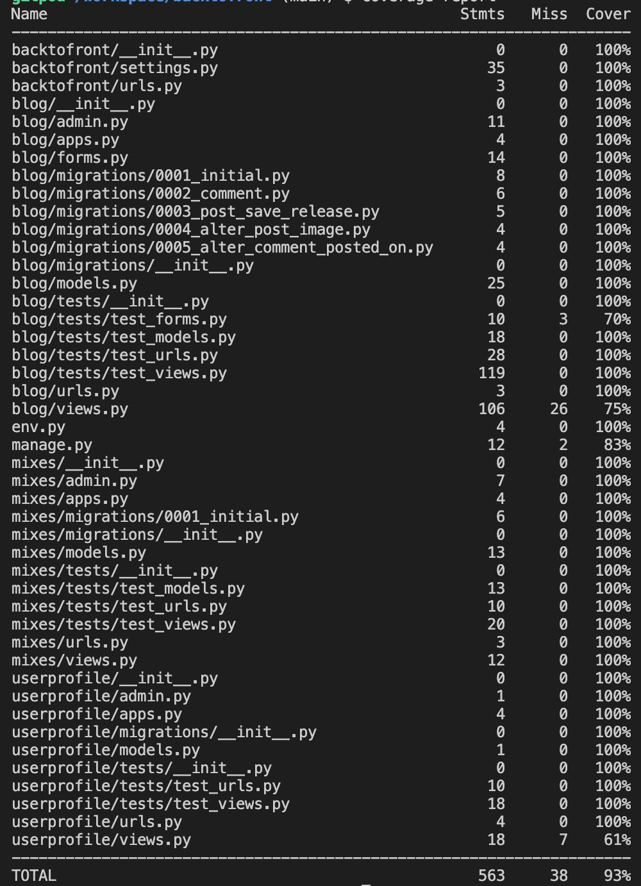
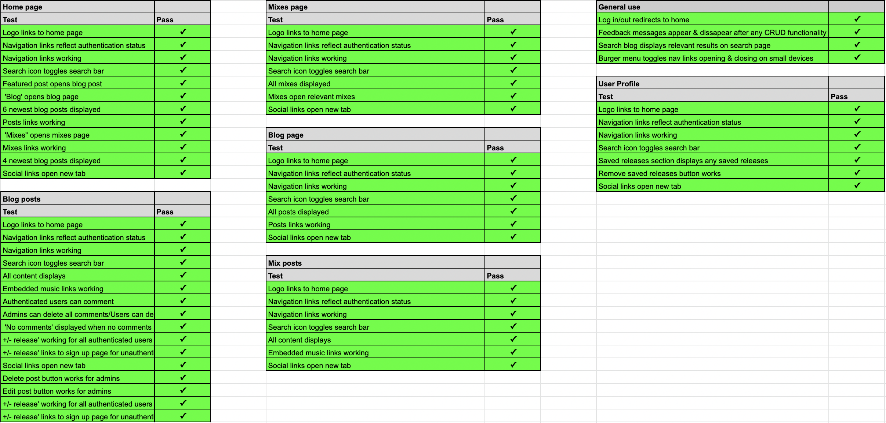
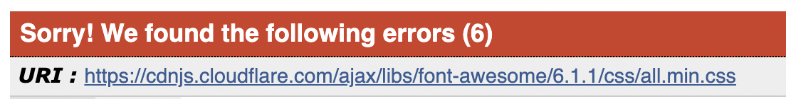
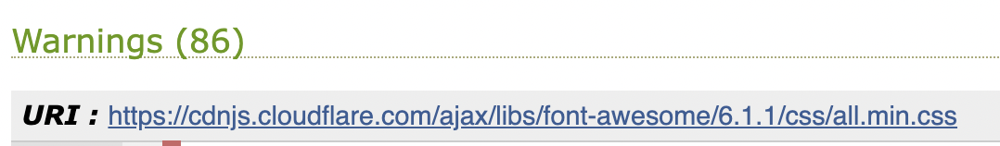
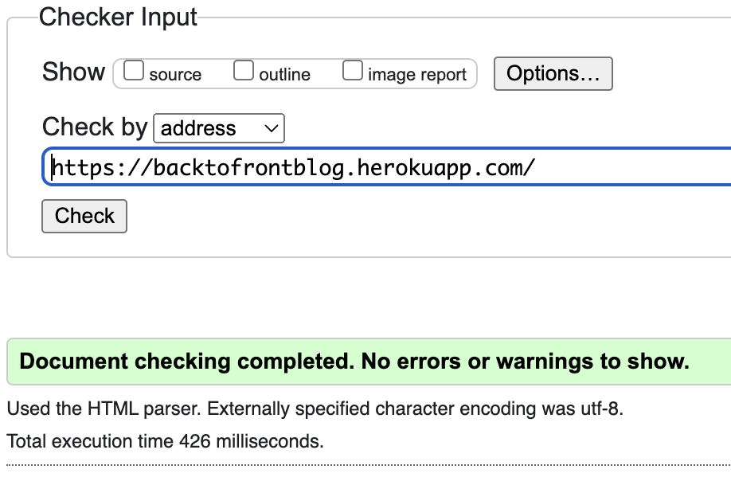
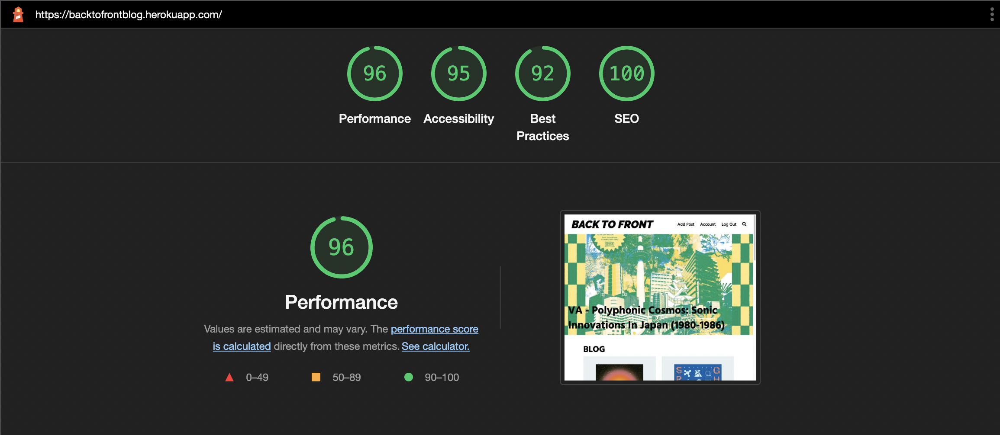

# Testing 

## Table of contents.

- [Unit Testing](#unit-testing)
- [Manual Testing](#manual-testing)
- [Security](#security)
- [Code Validation](#code-validation)
- [Responsivity](#responsivity)
- [Accessibility](#accessibility)
- [Issues](#issues)

## Unit Testing

I tested the relevent forms, models, urls & views for each app in the project using the Django Testing framework. The report attached used the python coverage package to show how what was covered by the automated testing, with a total of 93%:

This could have been improved upon as the test for the add post form and edit post form in the test_forms.py file for the blog was not passing as valid. I have left these tests in there for reference as I have identified the issue as being down to requiring an image field. As can be seen in the tests the image field is indeed included on both; the method I have used for them (SimpleUploadedFile) works across all of my other tests which they are included on however for these they will not pass as valid. I have tried numerous other methods such as a tempfile but the outcome is still the same. 

## Manual Testing

Manual testing was performed on for normal user usage, admin usage, and general site usage with on all pages. The record of these tests are below:

## Security

- Environment variables: these are stored in the env.py file during development and in the Heroku 'config variables during production

- User account: Used the python package Django Allauth to handle user accounts

## Code Validation 

- ### CSS

    - All the website's CSS code has been passed through the [W3C CSS Validator](https://jigsaw.w3.org/css-validator/) all custom code passes however errors and warnings are thrown regarding CSS delivered from the fontawseome CDN.

    
    

- ### Javascript

     - JavaScript has been passed through the [JSHint Validator](https://jshint.com/) and it has passed without errors.

- ### Python

     - All custom Python code passed the [PEP8 online check](http://pep8online.com/)
     - The settings.py file does contain lines which are too long for pep8 compliancy however I have left these so as not to effect their functionality.

- ### HTML

     - HTML code passed the [W3C Markup Validator](https://validator.w3.org/)

     

## Responsivity

I made use of Google Chrome's Dev Tools & via [Responsinator](http://www.responsinator.com/) to test the responsivity of the site throughout the development.

Once in production I manually tested the site's responsivity on my own devices:

- MacBook Air 13"
- MacBook Pro 13"
- iPhone XR
- iPad

And across the following browsers :

- Google Chrome
- Safari
- Firefox
- Microsoft Edge

## Accessibility

This was tested using Google's Lighthouse, the report is generated is attached below:

This was imporoved from the initial report with the following updates:

- adding alt tages to all images
- adding meta tags to the head with description & keywords
- adding a language tag to the html

When generating a report on some pages the best practises score drops to 83 which references a console error. This appears to be down to the script tag which is used to hide messages which display to the user. This is because if there is no messgae being displayed then the DOM is trying to access an element which appears as null as it does not currently exist.

## Issues

Issues that have been resolved:

- The use of fontawesomes python package app for django caused a lot of issues with storage/delivery of static files from cloudinary. Once the the site was deployed to heroku the site was could not load CSS files and lots of media files were not being displayed. This required a full wiping of the sites cloudinary storage, and then removal of the fontawesome app which was replaced by the CDN delivery link instead.

- When testing across different browsers the 'Raleway' font used for the site logo did not render as expected. This is because as it is a Google font, when used on Google Chrome you do not need to specify the font-weight or style as it appears as expected from the font import. This was fixed on other browsers by specifying the styling in the CSS stylesheets.

- As I intended users not to require an email address to sign up the initial sign up page displayed fine as email address is stated as optional. However if a user tried to sign up entering an email address then when they did click sign up they would not be logged in and would instead recieve a 500 internal server error. This was resolved by adding the allauth setting 'ACCOUNT_EMAIL_VERIFICATION' to 'none'.

- Embedded YouTube videos threw console errors regarding not being secure (https) links, even though they were. This meant they could not be played by users which was a big problem. This was resolved by adding the link for content-security-policy.

- The sites reponsivity was not working properly on smaller devices, which was resolved by adding the link for the viewport scale.

### Unresolved issues

After finishing testing I am not aware of any other errors/issues which need to be resolved.

