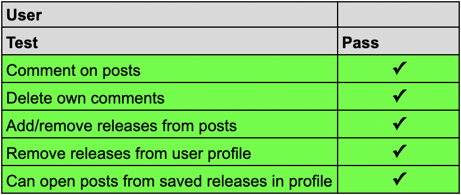
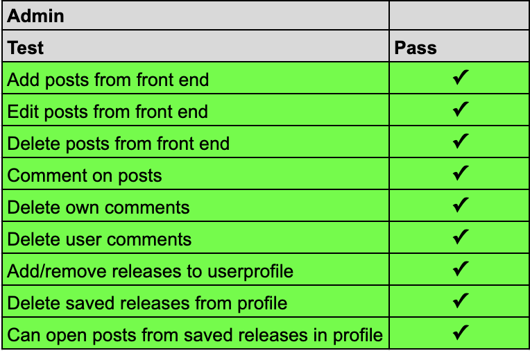
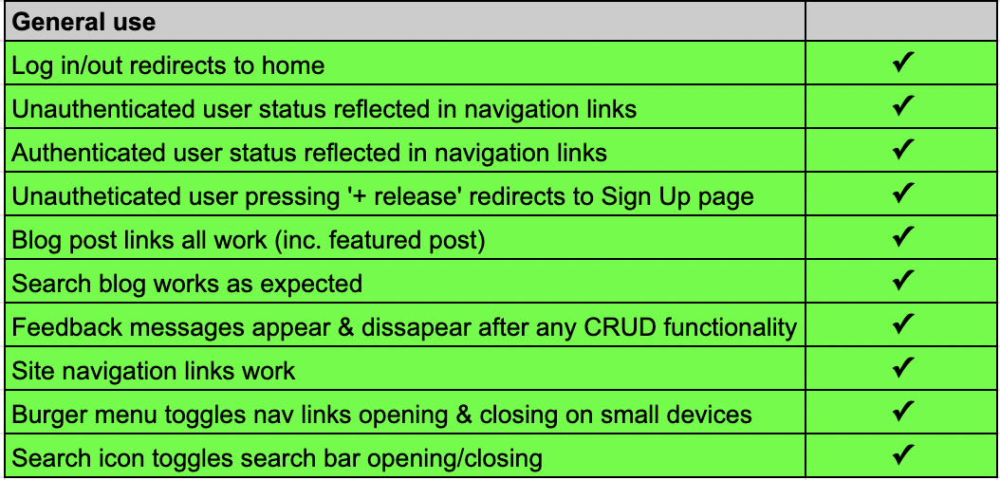

# Testing 

## Table of contents.

- [Unit Testing](#unit-testing)
- [Manual Testing](#manual-testing)
- [Security](#security)
- [Code Validation](#code-validation)
- [Responsivity](#responsiveness)
- [Accessibility](#accessibility)
- [Issues](#issues)

# Unit Testing

I tested the relevent forms, models, urls & views for each app in the project using the Django Testing framework. The report attached used the python coverage package to show how what was covered by the automated testing, with a total of 93%:

# Manual Testing

Manual testing was performed on for normal user usage, admin usage, and general site usage with the record of these tests below:

